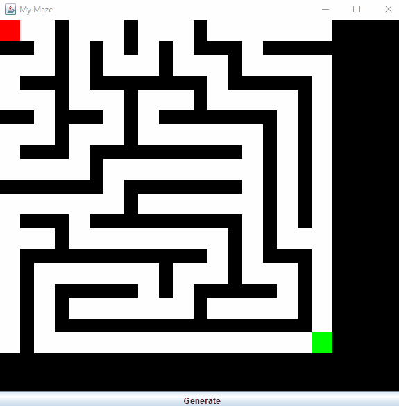

# Maze Generator

---

### Overview

Generates a maze by creating a graph and then using a recursive depth first search algorithm to carve out a path. The maze is then drawn on screen so that the user may solve it. The maze is purposely animated one block at a time so that the user can see the progression of the maze creation.

### Demo

---

---

### Controls

- The red square is the player and the green square is the end of the maze.
- Pressing an arrow key will move the player in the direction of the key.
- Use the generate button to create a brand new randomly generated maze.

### Requirements

- Java SE 11

---

### Installation

1. Download the jar file here
2. Double click jar file to run. You may have to explicitly mark the file as executable.